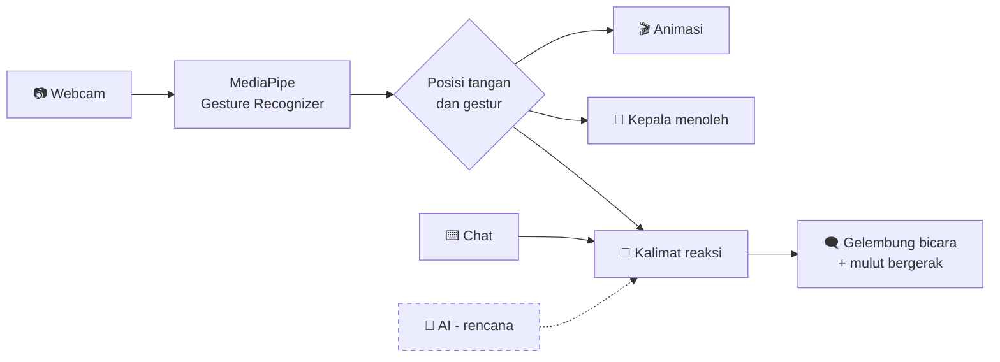

<div align="center">

# ✨ Hoshino Interactor ✨

### Karakter 3D yang melihatmu lewat webcam, menoleh ke tanganmu, dan bereaksi pada gesturmu.


[🚀 Coba Sekarang](#-coba-sekarang) · [🖐️ Gestur](#️-gestur-yang-didukung) · [🤖 Rencana AI](#-rencana-hoshino-yang-bisa-ngobrol) · [🗺️ Roadmap](#️-roadmap) · [🙏 Kredit](#-kredit--sumber-model)

<!-- Setelah merekam layar, simpan sebagai docs/demo.gif lalu hapus tanda komentar:

-->

</div>

---

## 🎯 Apa ini?

**Hoshino Interactor** adalah proyek interaktif berbasis browser: model 3D karakter tampil di layar, lalu **webcam-mu menjadi remote-nya**. Angkat tangan dan karakter ikut menoleh. Lambaikan tangan dan dia menyapa. Elus kepalanya dan dia bereaksi.

Semuanya berjalan **langsung di browser**. Tidak ada library Python yang perlu di-install, dan video kameramu diproses lokal.

> 🚧 **Status:** proyek masih dikembangkan. Interaksi tangan sudah ada, sedangkan **ngobrol dengan AI masih dalam rencana** (lihat [Rencana AI](#-rencana-hoshino-yang-bisa-ngobrol)).

---

## 🎮 Yang bisa kamu lakukan

| | Aksi | Hasil |
|---|---|---|
| 👀 | Gerakkan tangan (atau mouse) | Kepala karakter menoleh mengikutimu |
| 👋 | Lambaikan tangan | Karakter menyapa balik |
| 🫳 | Gerakkan tangan di atas kepalanya (**headpat**) | Karakter bereaksi malu-malu |
| 🖐️ | Peragakan gestur tertentu | Karakter memutar animasi yang sesuai |
| 💬 | Ketik di kotak chat | Karakter membalas dengan gelembung bicara dan mulut yang bergerak |
| 🎬 | Pilih animasi dari panel | Pratinjau semua gerakan bawaan model |
| 👄 | Klik bentuk mulut di panel | Atur mulut mana yang dipakai saat karakter bicara |

---

## 🖐️ Gestur yang didukung

Pengenalan gestur memakai model bawaan MediaPipe. Tahan gesturmu sekitar setengah detik.

| Gestur | Cara | Klip animasi (bisa diubah) |
|:---:|---|---|
| 👍 | Jempol ke atas | `Victory_Start` |
| ✌️ | Tanda peace | `Public01` |
| 🤟 | I-love-you | `Cafe_Reaction` |
| ☝️ | Telunjuk ke atas | `Normal_Callsign` |
| 👎 | Jempol ke bawah | `Vital_Panic` |
| ✊ | Kepalan | `Vital_Panic` |
| 👋 | Lambai (kiri-kanan, sekitar 2x per detik) | `Public01` |
| 🫳 | Headpat: gerakkan tangan di zona kepala | `Cafe_Reaction` |

> 💡 Ingin gestur lain memicu animasi lain? Cukup ubah satu baris di [`js/config.js`](js/config.js).

---

## 🚀 Coba sekarang

<details open>
<summary><b>⚡ Mulai dalam 5 langkah</b></summary>

<br>

**1. Unduh proyek**
```bash
git clone https://github.com/fhaa616/Hoshino-Interactor-3D.git
cd Hoshino-Interactor-3D
```

**2. Ambil model karakter**
Unduh [`Hoshino.glb`](https://github.com/lihaohong6/BlueArchiveModels/blob/main/Hoshino.glb) dari sumbernya (lihat [Kredit](#-kredit--sumber-model)), lalu taruh di folder `models/`:
```
models/Hoshino.glb
```
> Model tidak disertakan di repo ini. Kalau lupa menaruhnya, halaman akan menyediakan tombol **Pilih file .glb**.

**3. Jalankan server lokal**
- Windows: klik dua kali **`run.bat`**
- Atau lewat terminal:
  ```bash
  python -m http.server 8000
  ```

**4. Buka di browser**
👉 <http://localhost:8000> (Chrome atau Edge disarankan)

**5. Izinkan kamera** lalu angkat tanganmu 🖐️

> ⚠️ Jangan membuka `index.html` dengan klik dua kali (`file://`). Kamera dan modul JS membutuhkan server.

</details>

### ⌨️ Kontrol cepat

| Tombol | Fungsi |
|:---:|---|
| `R` | Putar arah hadap model 180° (kalau menghadap ke belakang) |
| `H` | Tampilkan atau sembunyikan zona headpat |
| 🖱️ klik-tahan + geser | Putar kamera |
| 🖱️ scroll | Zoom |

---

## 🤖 Rencana: Hoshino yang bisa ngobrol

> 🛠️ **Belum aktif.** Ini adalah bagian yang sedang direncanakan.

Tujuannya: Hoshino bukan cuma bereaksi dengan animasi, tapi **membalas obrolan dan aksi tanganmu dengan AI**, lengkap dengan emosi.

**Yang direncanakan:**

| Mode | Keterangan | Status |
|---|---|:---:|
| 🧪 Demo | Balasan sederhana berbasis kata kunci (sudah ada di panel chat) | ✅ Tersedia |
| 🏠 Ollama | Model AI berjalan lokal di komputermu, gratis | 🔜 Rencana |
| ☁️ API kompatibel OpenAI | Layanan gratis seperti Groq, OpenRouter, atau Gemini | 🔜 Rencana |
| 🗣️ Suara | Hoshino berbicara lewat text-to-speech browser | 🔜 Rencana |

**Gambaran cara kerjanya nanti:**
1. Kamu mengetik atau melakukan gestur, misalnya headpat.
2. Aksimu dikirim ke AI sebagai konteks, misalnya `*Sensei mengelus kepalamu*`.
3. AI membalas dengan tag emosi, misalnya `[shy] ...Mmn. Enak. Lanjutin aja, Sensei.`
4. Emosi dipetakan ke animasi, dan mulut karakter bergerak saat bicara.

> 🔐 Saat AI nanti dihubungkan, API key hanya akan disimpan di `localStorage` browsermu, tidak di kode dan tidak di repo.

---

## 🧠 Cara kerja



<details>
<summary><b>🔬 Detail teknis</b></summary>

<br>

- **Tracking tangan:** MediaPipe berjalan langsung di browser. Video tidak dikirim ke server mana pun.
- **Menoleh:** rotasi tulang leher dan kepala ditumpuk di atas animasi bawaan. Rotasinya dihitung di ruang dunia, jadi tidak bergantung pada orientasi sumbu tulang model.
- **Mulut:** model memakai beberapa mesh mulut. Yang aktif adalah mesh dengan morph weight 0, sehingga lip-sync dibuat dengan bergantian di antara bentuk mulut yang kamu pilih.
- **Lambaian:** deteksi gerakan kiri-kanan dengan ambang ayunan, supaya getaran kecil diabaikan.
- **Headpat:** posisi tulang kepala diproyeksikan ke layar sehingga zonanya mengikuti karakter.

</details>

---

## 🛠️ Kustomisasi

<details>
<summary><b>⚙️ Ubah perilaku lewat <code>js/config.js</code></b></summary>

<br>

| Pengaturan | Fungsi |
|---|---|
| `GESTURES` | Gestur mana memutar animasi apa, serta kalimat cadangannya |
| `WAVE` | Kepekaan deteksi lambaian |
| `PAT` | Ukuran zona dan kepekaan headpat |
| `LOOK` | Seberapa jauh dan seberapa halus kepala menoleh |
| `IDLE_CLIP` | Animasi saat karakter diam |
| `EMOTION_TO_CLIP` | Pemetaan emosi ke animasi (dipakai saat AI aktif nanti) |

**Mencari animasi yang cocok:** buka panel **Pengaturan → Animasi**, pilih klip dari dropdown, lalu klik **Putar**. Model ini punya puluhan klip bawaan.

</details>

<details>
<summary><b>📁 Struktur proyek</b></summary>

<br>

```
Hoshino-Interactor-3D/
├── index.html           # halaman utama
├── run.bat              # Windows: jalankan server lokal
├── css/style.css        # tampilan
├── js/
│   ├── config.js        # semua pengaturan
│   ├── main.js          # scene 3D, animasi, interaksi, chat
│   ├── hands.js         # tracking tangan dan pengenal gestur
│   ├── ai.js            # kerangka koneksi AI (demo / Ollama / API)
│   └── logic.js         # deteksi lambaian dan parser emosi
└── models/              # taruh Hoshino.glb di sini (tidak ikut repo)
```

</details>

---

## 🩺 Bantuan cepat

<details>
<summary><b>🐛 Pemecahan masalah</b></summary>

<br>

| Gejala | Solusi |
|---|---|
| Muncul tombol "Pilih file .glb" | Model belum ada di `models/Hoshino.glb`. Letakkan di sana atau pilih manual. |
| Layar kosong | Tekan F12, buka tab Console, dan periksa error. Pastikan internet aktif untuk memuat library. |
| Kamera tidak aktif | Izinkan kamera di browser dan tutup aplikasi lain yang memakainya (Zoom, Meet). |
| Tangan tidak terbaca | Pastikan ruangan terang dan tunggu model tangan selesai diunduh. |
| Karakter menghadap ke belakang | Tekan `R`. |
| `port 8000 already in use` | Tutup server lama atau pakai port lain: `python -m http.server 8001`. |

</details>

<details>
<summary><b>❓ FAQ</b></summary>

<br>

**Apakah videoku diunggah ke internet?**
Tidak. Tracking tangan berjalan lokal di browser.

**Kenapa harus lewat `localhost`?**
Browser hanya mengizinkan kamera di `localhost` atau HTTPS, dan modul JS tidak berjalan dari `file://`.

**Bisa pakai karakter lain?**
Bisa, pakai tombol **Pilih file .glb**. Nama tulang dan klip animasi tiap model berbeda, jadi pengaturan di `config.js` mungkin perlu disesuaikan.

**Kenapa model tidak ada di repo?**
Karakter dan modelnya bukan milik saya. Lihat bagian Kredit di bawah.

</details>

---

## 🗺️ Roadmap

- [x] Menampilkan model 3D dan memutar animasi
- [x] Tracking tangan dan pengenalan gestur
- [x] Kepala karakter mengikuti tangan
- [x] Reaksi lambaian dan headpat
- [x] Panel animasi dan pemilih bentuk mulut
- [x] Chat dengan mode demo
- [ ] Menghubungkan **AI lokal (Ollama)**
- [ ] Menghubungkan **AI via API gratis**
- [ ] Suara karakter (text-to-speech)
- [ ] Demo online lewat GitHub Pages
- [ ] GIF demo di README
- [ ] Dukungan lebih banyak karakter

💡 **Punya ide atau menemukan bug?** [Buka Issue](https://github.com/fhaa616/Hoshino-Interactor-3D/issues) 🙌

---

## 🙏 Kredit & sumber model

**Sumber model 3D:** [`lihaohong6/BlueArchiveModels`](https://github.com/lihaohong6/BlueArchiveModels), koleksi file `.glb` karakter Blue Archive yang dibagikan komunitas. Proyek ini memakai [`Hoshino.glb`](https://github.com/lihaohong6/BlueArchiveModels/blob/main/Hoshino.glb) dari sana. Terima kasih kepada pemilik repositori tersebut.

> ⚠️ **Catatan hak cipta**
> - Blue Archive beserta karakter dan asetnya adalah milik **NEXON Games** dan **Yostar**.
> - Repositori sumber model tidak mencantumkan lisensi atau keterangan penggunaan, sehingga file model **tidak disertakan** di repo ini. Unduh sendiri dari sumbernya.
> - Proyek ini adalah karya penggemar yang **non-komersial** dan **tidak berafiliasi** dengan pihak mana pun. Jika pemegang hak meminta, referensi ke model akan dihapus.

**Teknologi:**
- [Three.js](https://threejs.org/) untuk render 3D dan animasi
- [MediaPipe Tasks Vision](https://developers.google.com/mediapipe) untuk tracking tangan dan pengenalan gestur

---

## 📄 Hak cipta

Kode di repo ini © 2026 **fhaa616**. Semua hak dilindungi. Kode dibagikan di GitHub untuk dilihat dan dipelajari; untuk memakai ulang atau mendistribusikannya, mohon minta izin lebih dulu lewat [Issue](https://github.com/fhaa616/Hoshino-Interactor-3D/issues).

Hak cipta ini **hanya berlaku untuk kode**, bukan untuk model karakter maupun aset Blue Archive (lihat [Kredit](#-kredit--sumber-model)).

<div align="center">

⭐ **Kalau proyek ini seru, kasih bintang ya!** ⭐

</div>